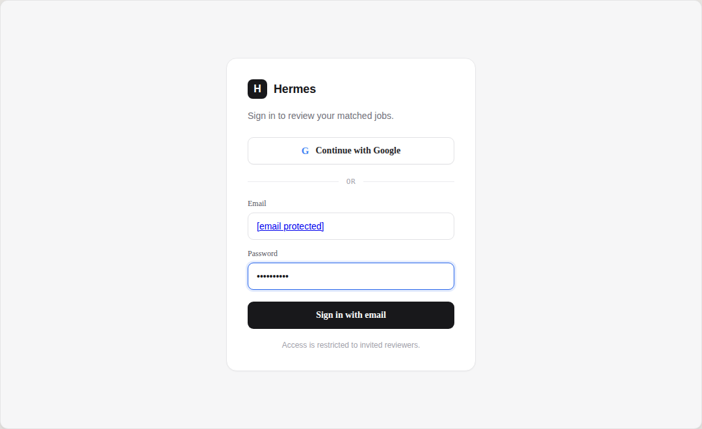
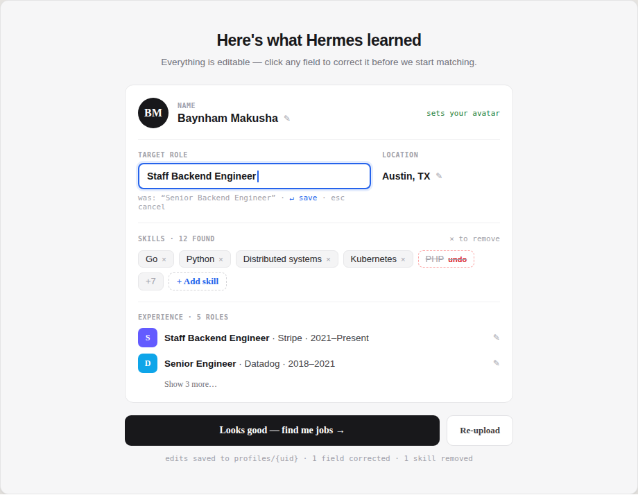
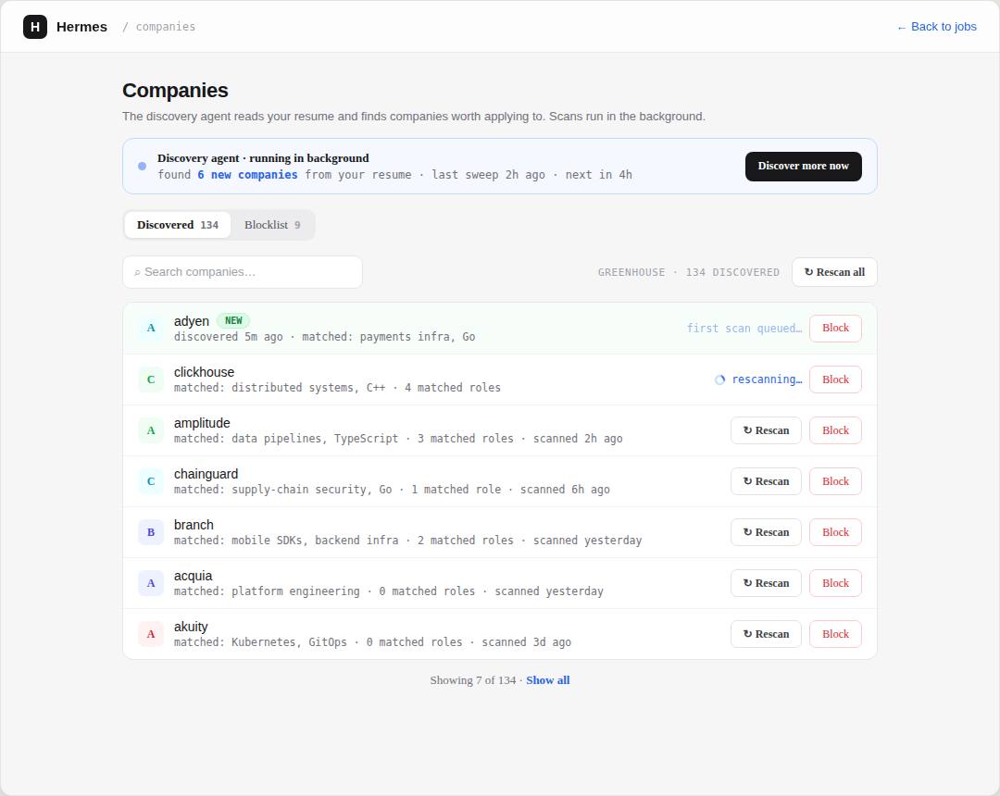
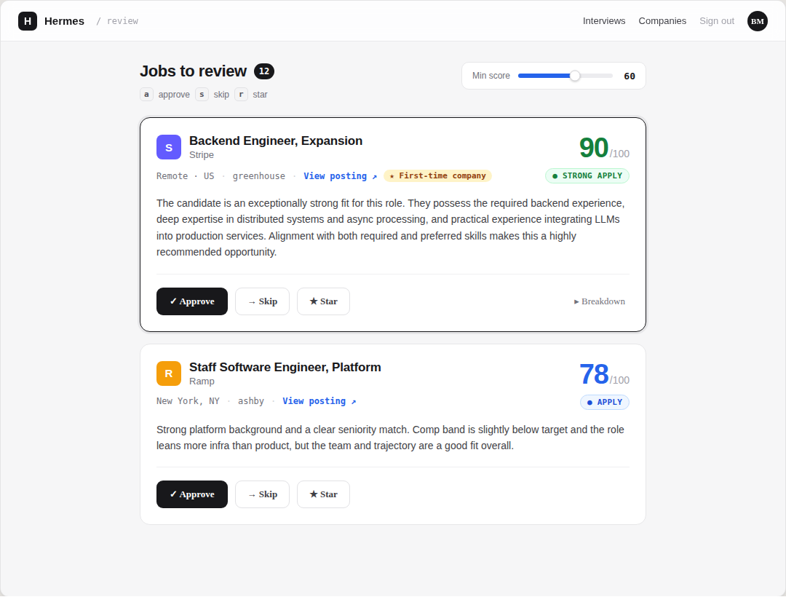
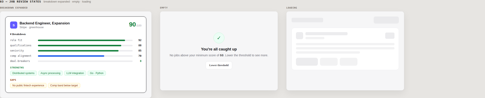
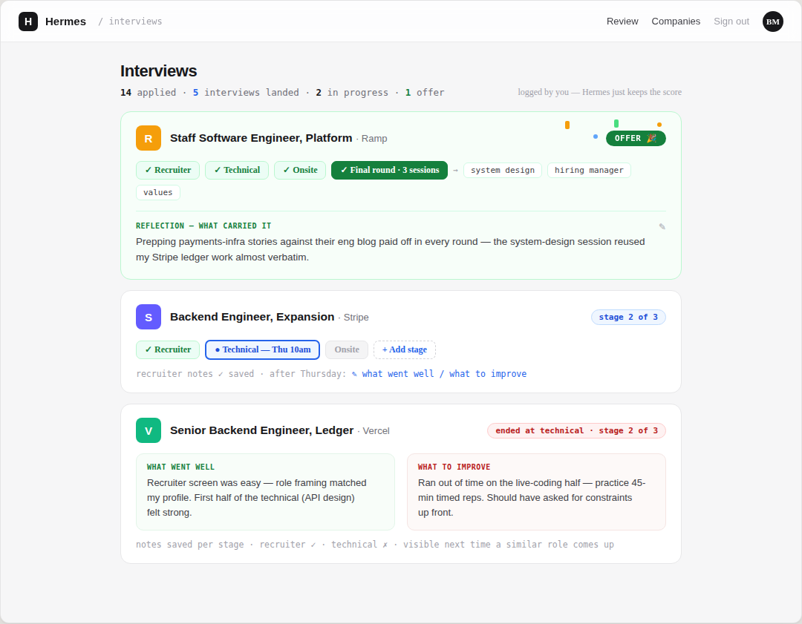
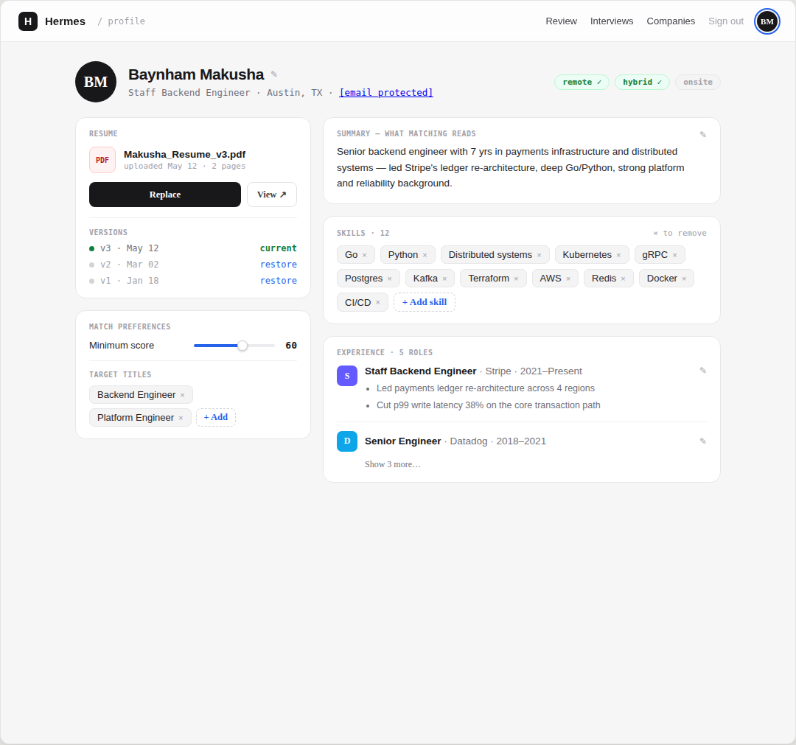

# Hermes

Hermes is a multi-agent **job-search assistant**: it builds a profile from your
résumé, discovers and ranks openings against it, tailors a résumé per posting,
and submits applications — surfaced through a web app and backed by an
agent/pipeline system on Google Cloud.

It is built on the [ADK](https://adk.dev/) with Vertex AI Gemini, a FastAPI
gateway, a Next.js frontend, and Firestore — deployed on Cloud Run.

## How it works

The end-to-end funnel:

```
onboarding → discovery → matching / vetting → tailoring → application → tracking
 (résumé →     (scout      (rank vs. profile,   (rerank      (submit to     (status +
  profile)      sources)    geo-eligibility)     bullets +    the ATS)       interview
                                                 objective +                  journal)
                                                 ATS docx)
```

An ADK **Coordinator** orchestrates five specialists. In practice the heavy
lifting for discovery, matching, tailoring, and application runs as
**deterministic pipelines** (`tools/` + `cli/` runners) that mirror each agent's
contract; the ADK agents in `agents/` keep the Coordinator and playground wiring.

### Screens

The web app (`web/`, Next.js) is where a user rides that funnel:

| Login | Onboarding — résumé parse review |
|---|---|
|  |  |

| Discovery — companies | Matching / vetting — job review |
|---|---|
|  |  |

| Matching — score breakdown | Tracking — interview journal |
|---|---|
|  |  |

| Profile |
|---|
|  |

`/` is job review (approve/skip/star, keyboard-driven, a running score/recommendation
per posting); `/tracking` is the live application pipeline, filled in as the
Application agent submits; `/interviews` is a separate, user-owned journal —
Hermes logs the score, the user logs stages, outcomes, and what to improve;
`/settings/companies` is the discovery source list (rescan/block per company);
`/profile` holds résumé versions, match preferences, skills, and experience.
Tailored résumés are reviewed and downloaded per application at
`/applications/{id}/review`.

(Screens above are drawn from current design mocks, not live-app screenshots.
Paywall/monetization UI is in progress and intentionally left out of this
overview.)

| Agent | Model | Role |
|-------|-------|------|
| Coordinator | `gemini-flash-latest` | Orchestrates the end-to-end flow |
| Discovery | — (ParallelAgent) | Scouts job boards + company careers concurrently |
| Matching | `gemini-3.1-pro-preview` | Ranks postings against the profile; geo-eligibility gate |
| Tailoring | `gemini-flash-latest` | Reranks bullets, writes an objective, renders an ATS-safe résumé |
| Application | `gemini-3.1-pro-preview` | Submits applications (Greenhouse via Playwright) |
| Tracking | `gemini-flash-latest` | Records application status (deferred) |

## Components

| Path | What it is |
|------|-----------|
| `agents/` | ADK agents (Coordinator + specialists). `_shared.py` defines the model helpers. |
| `tools/` | Deterministic pipeline logic — `discovery/`, `matching/`, `tailoring/`, `submitters/`, `profile/`, `ats/`, `gmail/`, `computer_use/`. |
| `cli/` | Batch runners for the pipelines (import résumé, sync profile, discovery, matching, tailoring, user migration). |
| `api/` | FastAPI gateway. Serves the ADK agents **and** the Firestore-backed web API: `routes/{jobs,companies,applications,profile}.py` with Firebase-auth deps. |
| `web/` | Next.js 16 frontend — login, onboarding/profile, job vetting (review/approve/skip/star), applications, company vetting. |
| `models/` | Pydantic schemas (`profile`, `job`, `match`, `application`). |
| `deployment/` | Terraform for Cloud Run + supporting infrastructure. |
| `tests/` | Unit, integration, and eval tests. |

## Data & storage

- **Firestore (Native)** — the profile lives at `users/{uid}`; `jobs`,
  `applications`, and company data are subcollections.
- **Cloud Storage** — tailored résumés (`.docx`) and submission screenshots
  (the `RESUME_BUCKET`).
- **Firebase Auth** — the web app signs users in; the API verifies Firebase ID
  tokens (with a local dev bypass gated on `AUTH_DEV_MODE`).

## Current state

- **Live:** Firebase-auth login, onboarding (résumé → profile, with an
  editable parse-review step), discovery (background company/job scouting
  with rescan/block controls), matching with a location-eligibility gate, the
  job-vetting web UI (`/`, approve/skip/star with a score breakdown),
  tailoring (bullets + objective + ATS-safe résumé to GCS with a diff/review
  screen at `/applications/{id}/review`), the Application agent's Greenhouse
  path (Playwright submit with SSE progress, screenshots, idempotency, and a
  manual-apply fallback), the `/tracking` application-status pipeline (filled
  in as agents write status), and the `/interviews` journal (user-logged
  interview stages/outcomes/reflections — Hermes contributes only the match
  score, never auto-tracks).
- **Deferred:** the Application "Computer Use" browser path for non-Greenhouse
  ATSes, and the Tracking agent's automatic Gmail-based response detection.
- **In progress (not covered here):** monetization/paywall.

## Deployment

Two Cloud Run services in `us-central1` (scale-to-zero): **`hermes-api`** (the
FastAPI gateway) and **`hermes-web`** (the Next.js app). CI/CD runs through
GitHub Actions — checks on every PR, and a deploy to Cloud Run on merge to
`main` via keyless Workload Identity Federation.

Built-in telemetry exports to Cloud Trace, BigQuery, and Cloud Logging.

## Running it

Local setup, the data-pipeline runbook, and deploy steps are kept out of this
README. See **`docs/RUNNING.md`** (a local operator runbook, not tracked in
git).
